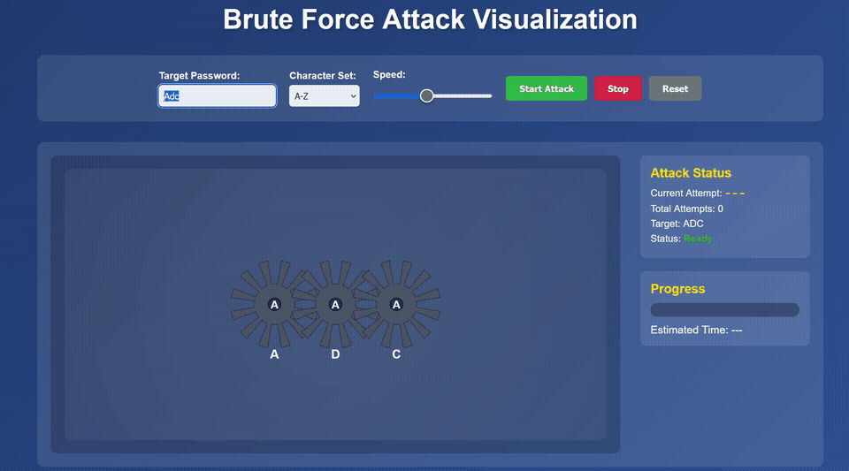
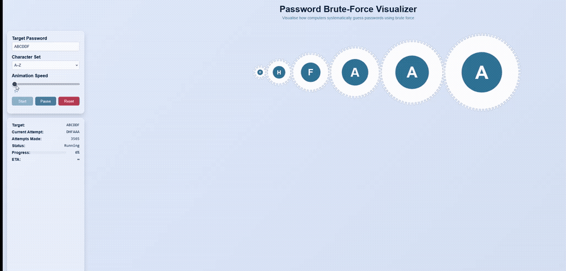

## v1 — July 2025 (Claude, first attempt)

## v2 — ChatGPT GUI agent (0-shot)

## v3 — March 2026 (Claude Code, Sonnet/Opus 4.6)

This project tracks how AI coding agents have evolved over time at the same task.

**v1** was the first Claude attempt in July 2025.

**v2** was built using ChatGPT's GUI agent shortly after it launched (0-shot with a very detailed prompt). The agent iterated against itself by testing the GUI, producing an impressive result. I don't take credit for this one.

**v3** was built in March 2026 with Claude Code running Claude Sonnet/Opus 4.6 — 8 months later. The model now generates a physically correct SVG gear train: proper tooth geometry, correct meshing, gear sizes derived from mechanical coupling (`N_i = N_0 × (i+1)`), speed ratios that follow from tooth counts (`ω_i = ω_0 × N_0/N_i`), and unit tests. It requires considerably more back-and-forth than a 0-shot GUI agent and I ran out of credits before the session ended, but the mechanical correctness is a clear step change.

Some major difference are explained because the newer anthropic models are not only much stronger at coding via RL but also are multimodal and can now ingest images. Furthermore, the agent tooling has also gotten much stronger. One thing of note was time to write was much higher (also token cost was very high), I'm actually suprised how slow claude is compared to other models/agent clis I have tested. It took 10 mins sometimes to write a feature, though it did not make any major mistakes besides a stroboscopic effect at one point. 

I think this shows the progress of the models and the tooling, that agents and LLMs should not be taken lighly. This is a greenfield project sure, but this is something a novice developer would take a day if not a weekend to build, in this case it was built in roughly 30 mins of inference time with little human input, and could have done it in parallel to reduce that even further.

